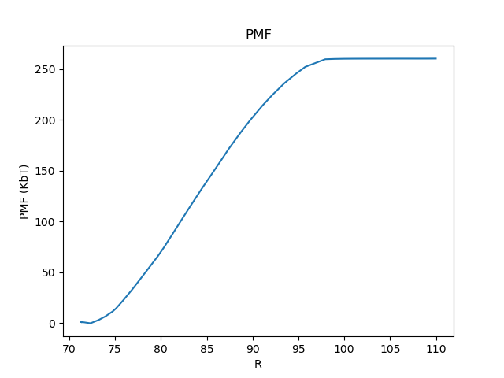
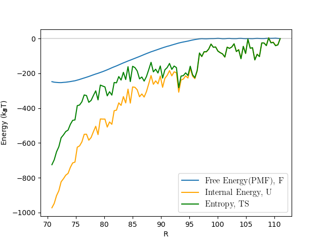
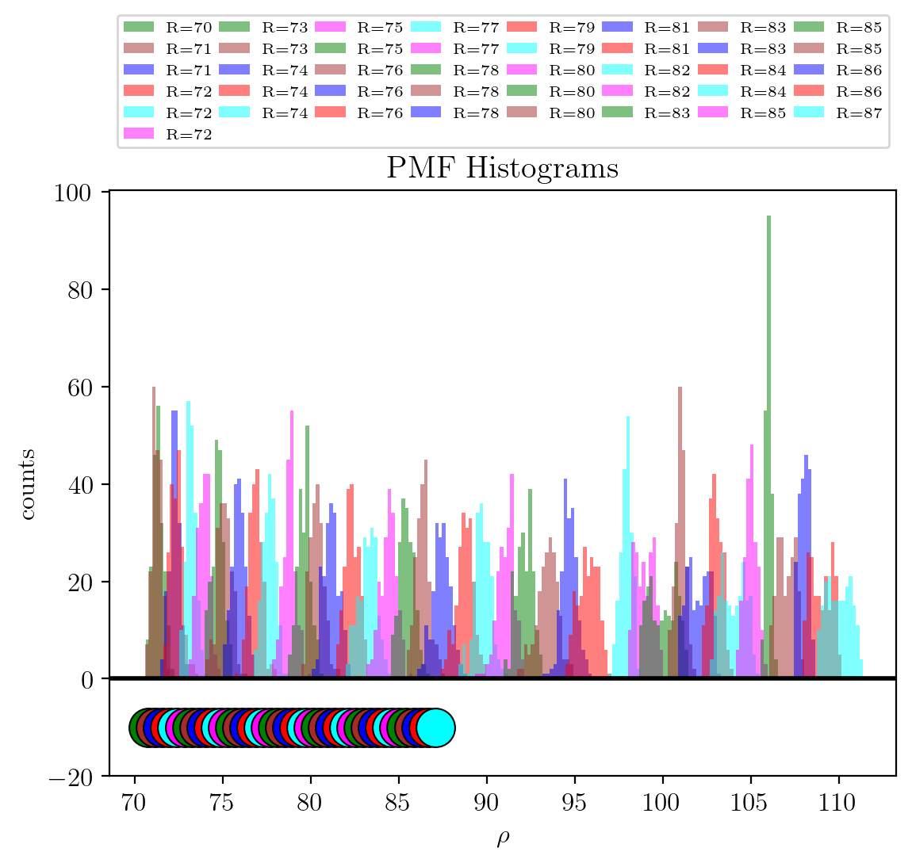

.. _AnalysisExample3:

Example 3: Wham Analysis (Potential of Mean Force)
==================================================

The following script can be used with the output of a simulation similar to :ref:`SimulationExample4` to compute the
potential of mean force, thermodynamic  quantities, PMF histograms, etc. and write the data for those quantities to
files. It is not necessary to run :ref:`SimulationExample4`. The data can be obtained
from here :download:`Download gzip data <data/example4.gzip>`

.. code-block:: python

    import numpy as np
    import matplotlib.pyplot as plt
    from hoodlt.Analysis.Collect.CollectLogData import CollectLogData
    from hoodlt.Analysis.Compute.ComputeStatistics import StatComputeTimeSeries
    from hoodlt.Data.Units.AngAmuEvUnits import AngAmuEvUnits
    from hoodlt.Analysis.Compute.ComputeWhamPotential2 import ComputeWhamPotential
    from hoodlt.Analysis.Plot.PlotWhamPotential import PlotWhamPotential

    n_frames = 200
    ff_name = 'opls_dry-ncs_mix'
    end_num = 111
    d_tuple = (0.4, 10)

    file_names = []
    for ind in range(70, end_num):
        file_name_1 = 'cAu4033S-Hydrocarbon-n17_cSphereSphere_'
        file_name_2 = '_pOpls_Dry-Ncs_Mix_uAngAmuEv_l_00p2'
        file_names.append(file_name_1+str(ind)+file_name_2)

    c_wham = ComputeWhamPotential(file_names, ff_name, num_frames=n_frames, d_r=d_tuple)
    plot_wham=PlotWhamPotential(c_wham)
    plot_wham.plot_pmf_approx()
    c_wham.solve()
    plot_wham.plot_pmf()
    c_wham.add_energies()

    plot_wham.plot_thermo_quantities()
    plot_wham.plot_histograms(c_wham.r)
    plot_wham.compare_bias_distributions()

The command plot_pmf_approx gives the pm calculated by integrating the force. The command
plot_wham.plot_pmf() gives the pmf computed from wham, see below

.. image:: pics/PMF.png
            :width: 45 %

The command lot_wham.plot_thermo_quantities() plots
the internal energy and entropy to the pmf, and plot_wham.plot_histograms(c_wham.r) computes the histogram
of bond distances.

Finally, plot_wham.compare_bias_distributions() gives a comparison between the biased distributions as computed from
the simulation or from the wham parameter values.
