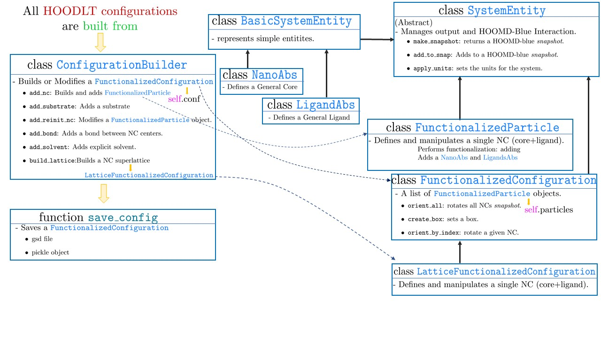

.. _HOODLTBuildstruct:

What is the Class Structure for Builiding a System
==================================================

The following diagram illustrates the classes and functions involved in building a structure:

The end user creates a :mod:`ConfigurationBuilder` object and save it with :mod:`save_config`.

A :mod:`FunctionalizedConfiguration` object contains all the information necessary to build the
system for HOOMD-Blue.

