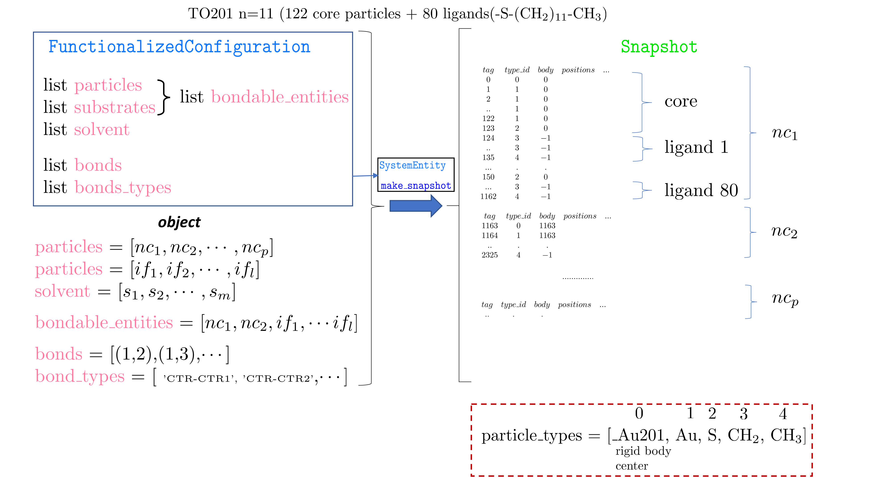

.. _HOODLTConfigOrg:

Configuration(HOODLT) -> snapshot(HOOMD)
========================================

Through :mod:`ConfigurationBuilder` A :mod:`FunctionalizedConfiguration` object is created
(and saved with :mod:`save_config`).

In order to run a MD simulation with HOOMD-Blue for the first time, it is necessary to build a
Snapshot containing the complete simulation state in a single object.

Here we describe how :mod:`FunctionalizedConfiguration` becomes a  HOOMD-Blue :mod:`snapshot`
thus allow to perform general MD.

HOODLT follows the conventions:

- Rigid body particles are identified by having the same body id as the center body tag.
- All particles have tag id's larger than the center body (HOOMD convention)
- The first atom on each ligand is the linker: It is attached to the core.
- If nc is a core object there are nc.graft_num binding sites with positions in nc.graft_sites.
- The first ligand is placed through the linker in the first position in nc.graft_sites, and so on.
- Any bonds you wish to set between nanoparticle rigid centers should begin with the prefix 'CTR-CTR'

The example below corresponds to several TO(201) cores functionalized with 80 dodecanethiol
ligands with some bonds among nanocrystals

The Sulphurs (S) are in the rigid body (including core), but are considered part of the ligand.

The snapshot also includes a list of all bond, angle, dihedrals, etc..that is not shown.

A concrete script is shown here :ref:`AnalysisExample4`
