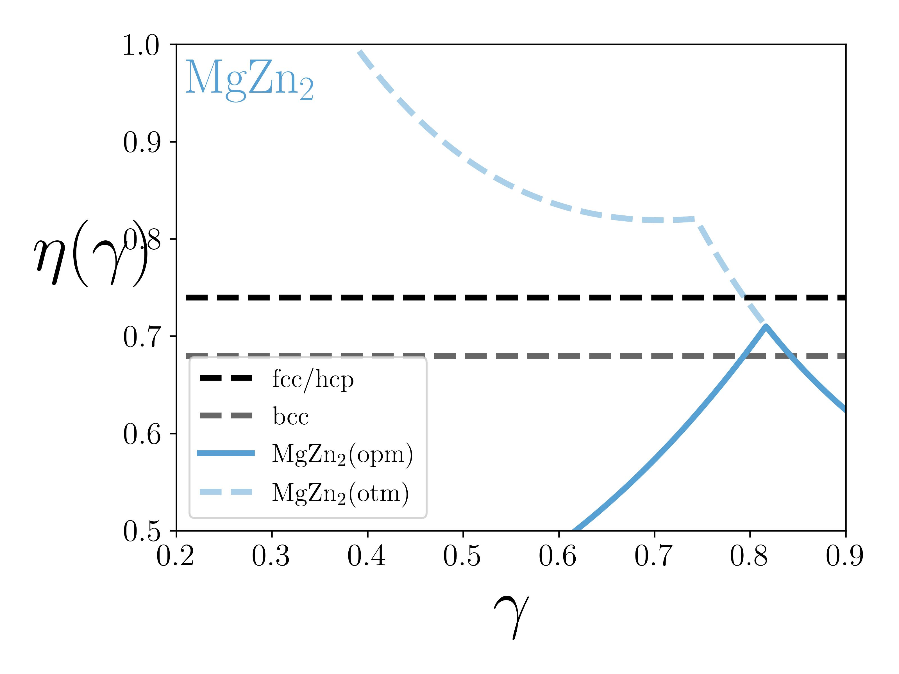
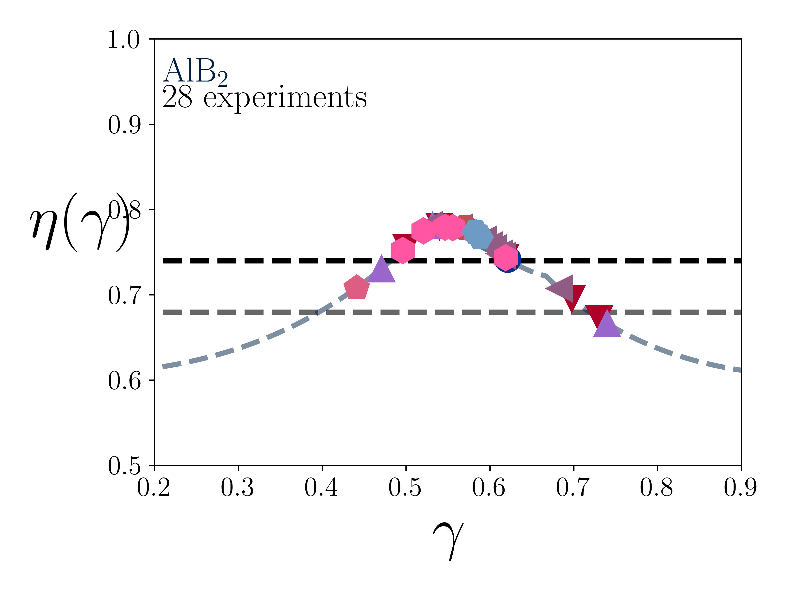
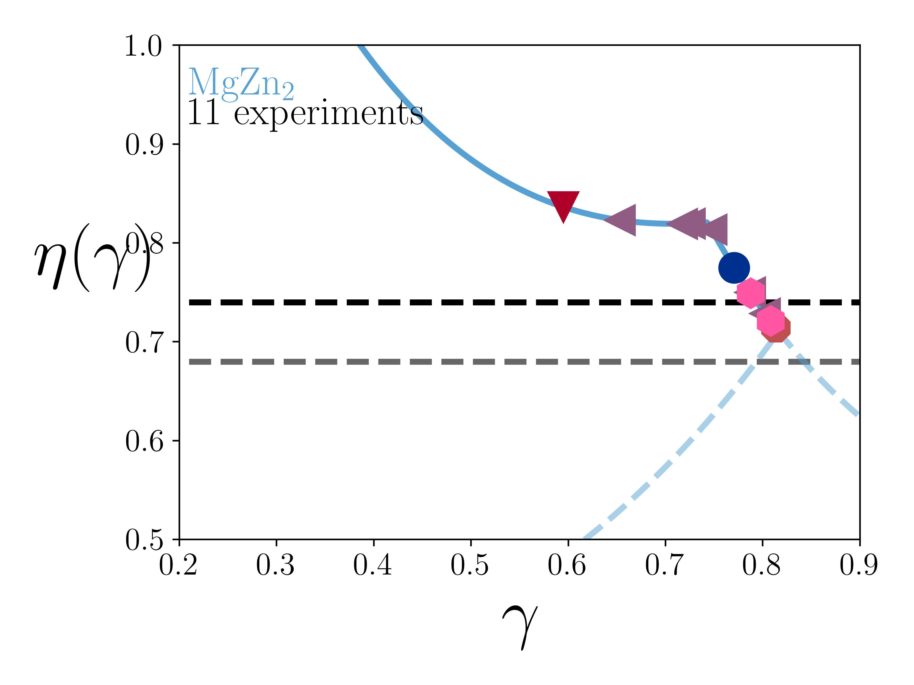
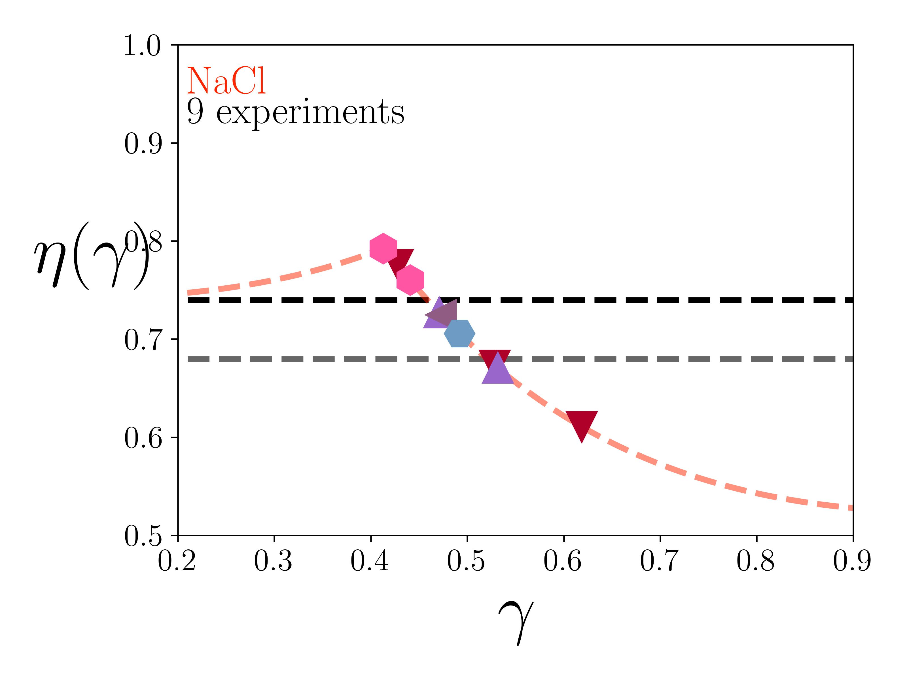

.. _HOODLTpackplots:

How to Make Plots of Packing Fractions (including OTM)
======================================================

The **OPM** (Optimal Packing Model) is equivalent to considering nanoparticles as **Hard Spheres**. The **OTM**
(Orbifold Topological Model) includes large ligand deformations ("vortices"), where the **Hard Sphere (HS)** picture
breaks down. Here is the MgZn2 BNSL packing fraction illustrating the **OTM** branch
for :math:`\gamma < \gamma_c=\sqrt{\frac{2}{3}}`

The script below generates the plot

.. code-block:: python

    import numpy as np
    import pandas as pd
    import matplotlib.pyplot as plt
    import pkg_resources

    import hoodlt.OTM.MgZn2_OTM as OTM_MgZn2

    # number of packign fractions to include in the plot
    num_pnts = 500
    a_lat = 1.0

    # include packing fractions between [0.5,1]
    y_min = 0.5
    y_max = 1.0
    # the range of gamma is between [0.2, 0.9]
    x_min = 0.2
    x_max = 0.9
    # line width
    lw = 3
    # use different opacity for otm
    op = 0.5

    # use LaTeX
    plt.rc('text', usetex=True)
    plt.rc('font', family='serif', serif='cm10', weight='bold', size=16)

    fig, ax1 = plt.subplots(1, 1)
    # plot fcc and bcc
    ax1.plot([0, 1], [0.74, 0.74], '--k', label='fcc/hcp', linewidth=lw)
    ax1.plot([0, 1], [0.68, 0.68], '--', color='#676767', label='bcc', linewidth=lw)
    mat_gamma = np.zeros(num_pnts)
    otm_pf = np.zeros(num_pnts)
    opm_pf = np.zeros(num_pnts)
    axs = ax1

    # compute the points
    for ind_g in range(num_pnts):
        # gamma value
        gamma = (float(ind_g)+1)/float(num_pnts+1)
        # build the OTM lattice object
        lat = OTM_MgZn2.OTMLatMgZn2Base12(3, a_lat, gamma)
        # compute the opm packing fraction
        opm_pf[ind_g] = lat.pf()
        # compute the otm packing fraction
        val = lat.otm_observables()
        pf = val.pf
        otm_pf[ind_g] = pf
        mat_gamma[ind_g] = gamma

    # plot name
    plot_name = lat.name()[0] + '_otm_pf.pdf'
    # note that the color is already defined within the lattice object (lat.name()[4])
    axs.plot(mat_gamma, opm_pf, lat.name()[4], label=lat.name()[1]+'(opm)', linewidth=lw)
    axs.plot(mat_gamma, otm_pf, lat.name()[4], ls='dashed',label=lat.name()[1]+'(otm)',linewidth=lw, alpha=op)
    # plot the lattice name
    axs.text(x_min+0.01, y_max-0.05, lat.name()[1], fontsize= 25, color=lat.name()[4])

    axs.set_xlabel(r'$\gamma$', fontsize=35)
    plt.ylim([y_min, y_max])
    plt.xlim([x_min, x_max])

    #plot legend
    axs.legend(fontsize='small')
    ax1.yaxis.labelpad = 15
    ax1.set_ylabel(r'$\eta(\gamma)$', fontsize=35, rotation=0)
    plt.tight_layout()
    plt.savefig(plot_name, dpi=500, format='jpg')

A more sophisticated plots including **experimental** as symbols look like that one below. Note that neither
NaCl or AlB2 contain OTM branches.

They are all generated at once from the following script

.. code-block:: python

    import numpy as np
    import pandas as pd
    import matplotlib.pyplot as plt
    import pkg_resources

    import hoodlt.OTM.AlB2_OTM as AlB2OTM
    import hoodlt.OTM.NaCl_OTM as NaClOTM
    import hoodlt.OTM.MgZn2_OTM as MgZn2OTM

    num_pnts = 500
    a_lat = 1.0

    y_min = 0.5
    y_max = 1.0
    x_min = 0.2
    x_max = 0.9
    lw = 3
    op = 0.5
    fsize = 20
    m_size = 15

    rad_circle = 0.01
    alpha_val = 0.5
    m_grey = [0.5, 0.5, 0.5]

    # this contains the experimental data
    fil = pkg_resources.resource_filename('hoodlt', 'Data/nanoparticle_list.xlsx')
    xls = pd.ExcelFile(fil)
    nano_list = xls.parse('Sheet1')
    super_list = xls.parse('Sheet2')

    refs = nano_list['reference'].unique()
    num_of_references = len(refs)

    lattice_class = [NaClOTM.OTMLatNaClBase8, AlB2OTM.OTMLatAlB2Base3, MgZn2OTM.OTMLatMgZn2Base12]

    plt.rc('text', usetex=True)
    plt.rc('font', family='serif', serif='cm10', weight='bold', size=16)

    legend = []
    leg_name = []

    for ind_l, lat_class in enumerate(lattice_class):
        fig, ax1 = plt.subplots(1, 1)
        ax1.plot([0, 1], [0.74, 0.74], '--k', label='fcc/hcp', linewidth=lw)
        ax1.plot([0, 1], [0.68, 0.68], '--', color='#676767', label='bcc', linewidth=lw)
        mat_gamma = np.zeros([2, num_pnts])
        mat_pf = np.zeros([2, num_pnts])
        axs = ax1
        num_inds = super_list[super_list['lattice'] == lat_class(3, a_lat, 0.5).name()[0]]
        for ind_g in range(num_pnts):

            gamma = (float(ind_g)+1)/float(num_pnts+1)
            lat = lat_class(3, a_lat, gamma)
            val = lat.otm_observables()
            indx = val.indx
            pf = val.pf
            mat_gamma[0, ind_g] = gamma
            mat_pf[0, ind_g] = lat.pf()

            if indx == 1:
                mat_gamma[1, ind_g] = gamma
                mat_pf[1, ind_g] = pf

        w1 = np.where(mat_pf[1] > 0)
        plot_name = lat.name()[0] + '_otm_pf_exp.jpg'
        axs.plot(mat_gamma[1][w1], mat_pf[1][w1], lat.name()[4], label=lat.name()[1], linewidth=lw)
        axs.plot(mat_gamma[0], mat_pf[0], lat.name()[4], ls='dashed', linewidth=lw, alpha=op)
        axs.text(x_min+0.01, y_max-0.05, lat.name()[1], fontsize= fsize, color=lat.name()[4])
        wrd = 'experiment'
        if len(num_inds) > 1:
            wrd += 's'
        str_pnts = '%d ' % len(num_inds) + wrd
        axs.text(x_min+0.01, y_max-0.08, str_pnts, fontsize = fsize)
        print(len(list(num_inds.iterrows())), lat.name()[0])
        for index, row in num_inds.iterrows():
            radA = nano_list[nano_list['name'] == row['A']]
            radB = nano_list[nano_list['name'] == row['B']]
            gamma = radB.iloc[0]['diameter (hexagonal lattice)']/radA.iloc[0]['diameter (hexagonal lattice)']
            lat = lat_class(3, a_lat, gamma)
            val = lat.otm_observables()
            indx = val.indx
            if indx == 1:
                pf = val.pf
            elif indx == -1:
                pf = 0.94
                circle1 = plt.Circle((gamma, pf), rad_circle, color=m_grey, fill=True, alpha=alpha_val)
                axs.add_artist(circle1)
            else:
            pf = lat.pf()
        print(index, gamma, pf, radA.iloc[0]['reference'], row['A'], row['B'])
        ref = radA.iloc[0]['reference']
        axs.plot(gamma, pf, radA.iloc[0]['symbol'], c=radA.iloc[0]['color'], markersize=m_size)

        axs.set_xlabel(r'$\gamma$', fontsize=35)
        plt.ylim([y_min, y_max])
        plt.xlim([x_min, x_max])

        ax1.yaxis.labelpad = 15
        ax1.set_ylabel(r'$\eta(\gamma)$', fontsize=35, rotation=0)
        plt.tight_layout()
        plt.savefig(plot_name, dpi=500, format='jpg')

    print('this calculation includes ', num_of_references, ' references')

At completion of the script, a list of all the references used to generate the experimental points for
each superlattice is displayed.

